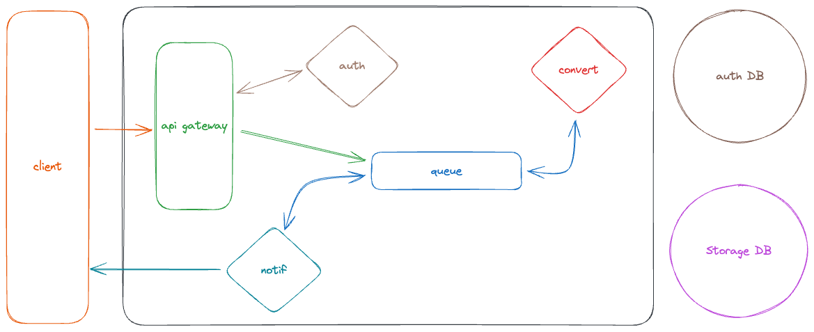

# log

video to mp3 convertion service



<https://www.youtube.com/watch?v=ZYAPH56ANC8&list=PL7g1jYj15RUP0SWYiLhllVEDFhp9Rd4jI>

installed

mysql, python3, docker, kubernetes, minikube, k9s

mkdir system_design

## auth service

auth forlder

add a .venv python

```bash
python3 -m venv .venv
source .venv/bin/activate # select it in vscode
```

dependencies

```bash
pip install pylint
pip install --upgrade pip
pip install pyjwt
pip install flask
pip install flask_mysqldb # had to brew install pkgconfig
```

```bash
mysql -uroot

    mysql> show databases;

# mysql -uroot -e "DROP DATABASE auth"
# mysql -uroot -e "DROP USER auth_user@localhost"

mysql -uroot < init.sql

    mysql> show databases;
    mysql> use auth;
    mysql> show tables;
    mysql> describe user;
    mysql> select * from user;

```

created server.py
created docker file

```bash
# python/src/auth
pip3 freeze > requirements.txt
docker build .
```

created docker account
new repository called <>auth

we need to tag the image to publish it
using the `sha` from docker build

```bash
docker tag aa9fc91349fd7ad327865467bc3c7a058526aa9f71d49b1fc20bab9caec3e30b jonathanoberlander/auth:latest
docker images
docker push jonathanoberlander/auth:latest
```

created all manifests
files for kubernetes

```bash
minikube start
# /system_design/python/src/auth/manifests
kubectl apply -f .
k9s # you can see everything

# stop namespace
kubectl get deployments --all-namespaces
# kubectl delete -n NAMESPACE deployment DEPLOYMENT
kubectl delete deployment auth
```

<https://stackoverflow.com/questions/40686151/kubernetes-pod-gets-recreated-when-deleted>

<https://kubernetes.io/docs/tutorials/hello-minikube/#create-a-docker-container-image>

<https://stackoverflow.com/questions/38979231/imagepullbackoff-local-repository-with-minikube>

`s` will enter the shell of the pod
`env` will show you your env
`env | grep MYSQL`

## gateway service

mkdir system_design

add a venv python

```bash
python3 -m venv .venv
source .venv/bin/activate # select it in vscode
env | grep VIRTUAL_ENV
```

select interpreter in vscode

install flask flask-pymongo pyMongo pika

```bash
mkdir auth_svc
touch __init__.py # to mark directory as a package
touch access.py
pip install requests
```

created storage and auth_svc
add the requirements and build the docker image

```bash
# python/src/gateway
pip3 freeze > requirements.txt
docker build .
docker tag 13717abd395337bb220a2c06af9a4a9c0260b50a8bc45be7855b732507792ebe jonathanoberlander/gateway:latest
docker images
docker push jonathanoberlander/auth:latest
```

once push we create our kube manifests for the gateway \
we add an ingress as the entry point, the default ingress proxy is nginx,  \
we setup nginx the config in the ingress file \
we create an entry point "mp3converter.com" \
for that we need to update our hosts files

```bash
# root
nvim /etc/hosts
# add a loopback to localhost like so:
127.0.0.1 mp3converter.com
```

Then we bind our mp3converter.com to our loopback address using the ingress minikube addon and tunnel.

[minikube config](https://minikube.sigs.k8s.io/docs/start/)

```bash
minikube addons list

# | ingress | minikube | disabled | Kubernetes |

minikube addons enable ingress
minikube tunnel
```

```bash
# to stop minikube
minikube stop

# you can delete the minikube instance like so
minikube delete --all
```

same thing as before

```bash
minikube start
kubectl apply -f ./python/src/auth/manifests/
kubectl apply -f ./python/src/gateway/manifests/
k9s # you can see everything
```

right now we can't deploy the gateway successfully yet because rabiitmq is mot configured \

to scale down we can  update the number of replicas using the cli:

```bash
kubectl scale deployment --replicas=0 gateway
```